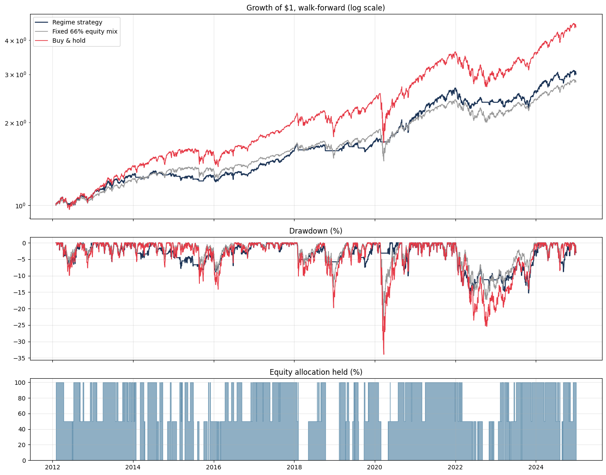
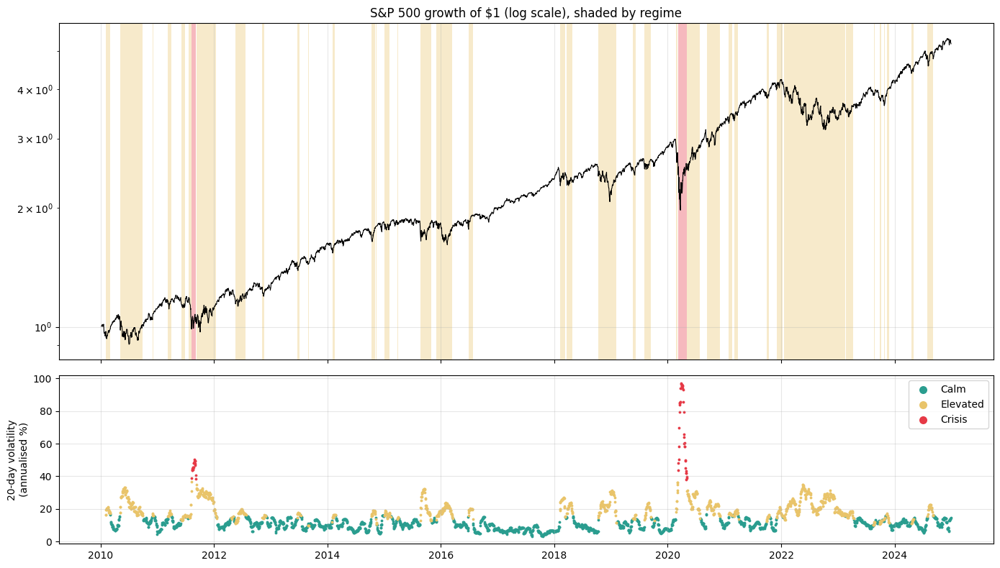

# Volatility Regimes and Risk Control (S&P 500, 2010–2024)

Detects volatility regimes in the S&P 500 with a Gaussian Mixture Model, tests lead-lag relationships between five asset classes, and evaluates a regime-based de-risking rule with a walk-forward backtest that only ever uses past data.

**Main finding:** volatility regimes are a reliable **risk** signal but not a **return** signal. Cutting equity exposure in high-volatility regimes reduced the worst drawdown versus buy-and-hold in every test run (median −20% vs −34%), at the cost of lower returns. Compared with a fixed equity/cash mix holding the same average equity weight, the benefit is smaller and depends on settings.

> **Correction notice (v2.0).** An earlier version of this repository reported a +3,616% return, a 27.3% CAGR and a Sharpe ratio of 2.80. Those numbers came from look-ahead bias: each day's regime was computed from that day's own return and then applied to the same day. The Granger causality tests also never ran (every test raised an error that was recorded as "no relationship"), and a negative oil price in April 2020 corrupted the oil data. All of this has been fixed, the results below replace the old ones, and [notebook 04](notebooks/04_regime_forecasting.ipynb) reproduces the original calculation to show exactly where it went wrong.

---

## Results

### Out-of-sample backtest (2 Feb 2012 – 30 Dec 2024)

Model refit every month on the previous 504 trading days only. The regime observed at the close of day *t* sets the position for day *t+1*. Trading cost of 5 bps per unit of turnover; cash earns 0%.

Allocation rule: Calm → 100% equities, Elevated → 50%, Crisis → 0%.

| | Regime strategy | Fixed 66% equity mix | Buy & hold |
|---|---|---|---|
| CAGR | 8.9% | 8.4% | 12.3% |
| Annual volatility | 9.5% | 11.1% | 16.7% |
| Sharpe ratio | 0.94 | 0.78 | 0.78 |
| Max drawdown | −15.7% | −23.5% | −33.9% |

The fixed mix holds the strategy's average equity weight (66%) every day. It separates the effect of *timing* from the effect of simply *holding less equity*.



### Robustness (30 runs: 10 random seeds × 1-, 2- and 3-year training windows)

| Compared with | Smaller max drawdown | Higher Sharpe | Higher CAGR |
|---|---|---|---|
| Buy & hold | 30 of 30 | 10 of 30 | 0 of 30 |
| Fixed mix, same average equity weight | 21 of 30 | 10 of 30 | 5 of 30 |

All 10 runs with a higher Sharpe ratio used the 2-year training window, so the headline run above is at the favourable end of the range. The drawdown reduction against buy-and-hold is the only result that holds in every run.

### What the regimes look like (full-sample description)

| Regime | Share of days | Next-day volatility (annualised) | Typical run length |
|---|---|---|---|
| Calm | 63.5% | 11.3% | 37 days |
| Elevated | 34.9% | 21.3% | 20 days |
| Crisis | 1.6% | 60.4% | 30 days |

Next-day volatility rises sharply from regime to regime, while next-day average returns are small relative to their noise. The Crisis regime covers only 60 days from two episodes (August–September 2011 and March–May 2020), so statistics for it are uncertain.



### Other findings

- **Stress windows.** In the walk-forward run the strategy lost 2.2% from the February 2020 peak to the March low (buy-and-hold −33.6%) and 10.6% in the 2022 bear market (−24.9%). It also missed most of the rebound: +8.3% from 24 March to 8 June 2020 versus +44.5%.
- **Lead-lag tests.** After Bonferroni adjustment for 20 tests, four one-day lead-lag relationships are significant, including S&P 500 → NASDAQ and S&P 500 → US Dollar Index. These are predictive associations, not proof of causation, and some may come from the series closing at different times of day. Whether they are large enough to trade was not tested.
- **Correlations** (corrected oil data): S&P 500 vs NASDAQ 0.95, vs oil 0.28, vs gold 0.05, vs US dollar −0.20.
- **Forecasting regimes.** A random forest did not beat the naive forecast "tomorrow's regime = today's regime" at 1-, 5- or 20-day horizons. Regimes are persistent, and that persistence is most of their predictability.

---

## Method

1. **Data** ([notebook 01](notebooks/01_data_collection.ipynb)): daily closes for S&P 500, NASDAQ, gold futures, WTI oil futures and the US Dollar Index from Yahoo Finance. Returns computed from non-positive prices are set to missing (WTI settled at −$37.63 on 20 April 2020).
2. **Regimes** ([notebook 02](notebooks/02_regime_detection.ipynb)): GMM with 3 components on rolling 20-day mean, volatility and skew of S&P 500 returns. Components are re-ordered by volatility after every fit so labels are consistent.
3. **Cross-asset analysis** ([notebook 03](notebooks/03_causal_inference.ipynb)): correlations, Granger F-tests with multiple-testing adjustment, regime-conditional tests that keep true calendar lags, VAR and impulse responses.
4. **Backtest** ([notebook 04](notebooks/04_regime_forecasting.ipynb)): walk-forward refits, one-day signal lag, trading costs, fixed-mix benchmark, robustness grid, cost sensitivity, stress episodes and out-of-sample regime forecasting.
5. **Report** ([notebook 05](notebooks/05_llm_insights.ipynb)): a Markdown report generated from computed results ([results/analysis_report.md](results/analysis_report.md)). An LLM can optionally explain the facts in plain English; any number in its text that is not in the computed facts is flagged.

### Safeguards against look-ahead bias

- Positions always use the previous day's signal; `RegimeStrategy` refuses a lag of 0.
- Each walk-forward refit sees only data from before the month it classifies.
- A test rewrites all returns after a cut-off date and checks that every earlier result is unchanged.
- Mutation check: re-introducing the original same-day bug makes three tests fail.

---

## Repository structure

```
├── src/
│   ├── data.py           Returns with invalid-price handling, data quality report
│   ├── regimes.py        Rolling features, GMM regimes ordered by volatility, HMM option
│   ├── causality.py      Granger F-test, multiple-testing adjustment, VAR/IRF, shocks
│   ├── strategy.py       Regime allocation with a one-day signal lag
│   ├── backtesting.py    Metrics, walk-forward backtest, robustness, fixed-mix benchmark
│   ├── forecasting.py    Markov transitions, out-of-sample ML forecasts vs naive baseline
│   ├── llm_insights.py   Reports from computed facts, optional grounded LLM narration
│   └── utils.py          Extra metrics, configuration, validation helpers
├── notebooks/            01–05, executed with outputs
├── tests/
│   ├── test_smoke.py         Imports and end-to-end runs
│   └── test_correctness.py   Look-ahead, label ordering, test statistics, metrics
├── data/                 Raw prices, cleaned returns, in-sample regimes
└── results/              Summary metrics (JSON), robustness runs (CSV), report, charts
```

## Quick start

```bash
git clone https://github.com/Avisweta-De/causal-regime-time-series.git
cd causal-regime-time-series
python -m venv venv && source venv/bin/activate   # Windows: venv\Scripts\activate
pip install -r requirements.txt

python -m pytest tests/ -v        # no internet or API key needed
jupyter notebook notebooks/       # run 01 → 05 in order
```

```python
import pandas as pd
from src import walk_forward_regime_backtest, performance_metrics

returns = pd.read_csv("data/processed/market_returns.csv", index_col=0, parse_dates=True)["^GSPC"]
result = walk_forward_regime_backtest(returns, train_window=504, cost_per_unit_turnover=0.0005)
print(performance_metrics(result["strategy_returns"])["Max Drawdown"])
```

The notebook download cell needs internet access; everything else runs offline from the saved data. `statsmodels` is needed only for the ADF, VAR and impulse-response cells, and `openai` only for the optional narration.

## Limitations

- One equity index and one 15-year period. The results may not hold in other markets or periods.
- The Crisis regime is based on two episodes.
- Cash earns 0%; taxes, slippage and market impact are not modelled.
- Regimes describe volatility that has already risen. They react after the first large move, not before it.
- This is a research project, not investment advice.

## Author

**Avisweta De**, MSc Data Science, IIIT Lucknow · [GitHub](https://github.com/Avisweta-De) · [LinkedIn](https://linkedin.com/in/avisweta-de)

MIT License
